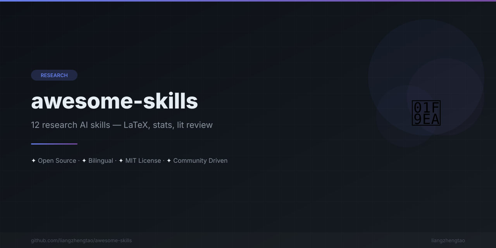

[中文版](README.zh.md)
n<div align="center">



</div>


<div align="center">

# 🧪 Awesome Skills

### AI Coding Assistant Skills for Researchers


<br/>

[](https://awesome.re)
[](CONTRIBUTING.md)
[](LICENSE)
[](#skills-table)

<br/>

### 🎯 Stop explaining your research workflow to AI every time.<br/>Write the skill once. Get perfect results forever.

</div>

---

### 💡 What is this?

**Awesome Skills** is a curated collection of [AI coding assistant skills](https://kimi.ai) — reusable instruction files that teach your AI assistant how to perform research tasks *exactly* the way you want.

Instead of writing the same prompt over and over, you write a **skill once** — and your AI assistant follows it perfectly every single time.

---

### 😤 Before vs After

<table>
<tr>
<th width="50%">❌ Without Skills</th>
<th width="50%">✅ With Skills</th>
</tr>
<tr>
<td>

**You:** "Help me write a LaTeX paper"

**AI:**
- Generates generic LaTeX template
- Missing `\usepackage` for your field
- No journal-specific formatting
- Citations in wrong format
- Figures not properly referenced

*You spend 30 min fixing everything...*

</td>
<td>

**You:** "Write my paper using `latex-paper` skill"

**AI:**
- Uses your target journal's exact template
- Correct citation format (APA/IEEE/Nature)
- Proper `\label` and `\ref` for all figures
- Statistical tests reported correctly
- Code compiles without errors on first try

*Ready to submit in 5 min* ✨

</td>
</tr>
<tr>
<td>

**You:** "Analyze this CSV data"

**AI:**
- Runs basic `describe()` and a bar chart
- No normality test, no effect size
- Missing confidence intervals
- Wrong statistical test for your data type
- You redo the entire analysis manually

</td>
<td>

**You:** "Analyze using `statistical-analysis` skill"

**AI:**
- Checks data distribution first
- Selects correct test (parametric vs non-parametric)
- Reports effect sizes and CIs
- Generates publication-quality figures
- Outputs APA-formatted results section

</td>
</tr>
</table>

---

### 🚀 Quick Start

Skills are just **instruction files** that tell your AI assistant how to behave. Drop them into your project and your AI will follow the instructions automatically.

#### Cursor (.cursorrules)

```bash
# Copy skill to your project root
cp skills/latex-paper.md .cursorrules

# Or append to existing rules
cat skills/latex-paper.md >> .cursorrules
```

#### Claude Code (CLAUDE.md)

```bash
# Copy skill to your project root
cp skills/latex-paper.md CLAUDE.md

# Or append to existing instructions
cat skills/latex-paper.md >> CLAUDE.md
```

#### Kimi Code (AGENTS.md)

```bash
# Copy skill to your project root
cp skills/latex-paper.md AGENTS.md

# Or append to existing instructions
cat skills/latex-paper.md >> AGENTS.md
```

> 💡 **Pro tip:** You can combine multiple skills by concatenating them into a single file!

---

<a name="skills-table"></a>

### 📚 Skills Catalog

#### 📝 Academic Writing / 学术写作

| Skill | Description | Use When |
|-------|-------------|----------|
| [`latex-paper`](skills/latex-paper.md) | LaTeX paper writing with journal-specific formatting | Writing journal or conference papers |
| [`research-proposal`](skills/research-proposal.md) | Grant and thesis proposal writing | Applying for funding or writing thesis proposals |
| [`literature-review`](skills/literature-review.md) | Systematic literature review and synthesis | Reviewing a research field or writing related work |
| [`academic-english`](skills/academic-english.md) | Academic English polishing and grammar | Polishing non-native English writing |

#### 📊 Data Analysis / 数据分析

| Skill | Description | Use When |
|-------|-------------|----------|
| [`statistical-analysis`](skills/statistical-analysis.md) | Statistical testing with proper assumptions checks | Analyzing experimental data |
| [`data-visualization`](skills/data-visualization.md) | Publication-quality figures (matplotlib/seaborn/plotly) | Creating figures for papers |
| [`ml-experiment`](skills/ml-experiment.md) | ML experiment tracking with proper baselines | Running machine learning experiments |

#### 📖 Literature Management / 文献管理

| Skill | Description | Use When |
|-------|-------------|----------|
| [`zotero-integration`](skills/zotero-integration.md) | Zotero bibliography integration | Managing references with Zotero |
| [`citation-management`](skills/citation-management.md) | Citation formatting across styles | Formatting references for different journals |

#### 🔬 Experiment Tools / 实验工具

| Skill | Description | Use When |
|-------|-------------|----------|
| [`jupyter-notebook`](skills/jupyter-notebook.md) | Clean Jupyter notebook workflows | Running and organizing notebooks |
| [`docker-reproducibility`](skills/docker-reproducibility.md) | Reproducible research environments | Setting up reproducible experiments |

#### 📬 Paper Submission / 论文投稿

| Skill | Description | Use When |
|-------|-------------|----------|
| [`conference-submission`](skills/conference-submission.md) | Conference submission checklist and formatting | Submitting to NeurIPS, ICML, CVPR, etc. |

---

### 🎬 Usage Examples

#### Example 1: Writing a Full Paper

```bash
# 1. Load the latex-paper skill
cp skills/latex-paper.md CLAUDE.md

# 2. Ask your AI assistant
"Write a LaTeX paper for IEEE TPAMI on my transformer attention mechanism.
Include: abstract, introduction, related work, method, experiments, conclusion.
Use IEEE citation format. Reference figures as Fig. 1, Fig. 2, etc."
```

#### Example 2: Analyzing Experiment Data

```bash
# 1. Load the statistical-analysis skill
cp skills/statistical-analysis.md .cursorrules

# 2. Ask your AI assistant
"Analyze the data in results.csv. Compare model A vs model B performance.
Check normality, run appropriate tests, report effect sizes and CIs.
Generate a box plot for Figure 1."
```

#### Example 3: Complete Research Workflow

See [`examples/research-workflow.md`](examples/research-workflow.md) for a full end-to-end workflow combining multiple skills.

---

### ❓ FAQ

<details>
<summary><b>Q: What AI assistants do these skills work with?</b></summary>

These skills work with any AI coding assistant that supports custom instructions:
- [Cursor](https://cursor.sh) via `.cursorrules`
- [Claude Code](https://claude.ai/code) via `CLAUDE.md`
- [Kimi Code](https://kimi.ai) via `AGENTS.md`
- [Windsurf](https://windsurf.ai) via `.windsurfrules`
- [Cline](https://github.com/cline/cline) via `.clinerules`
- [Aider](https://aider.chat) via `.aider.conf.yml`
- Any assistant that reads instruction files

</details>

<details>
<summary><b>Q: Can I combine multiple skills?</b></summary>

Yes! Simply concatenate the skill files:

```bash
cat skills/latex-paper.md skills/data-visualization.md > CLAUDE.md
```

Or use them selectively based on your current task.

</details>

<details>
<summary><b>Q: How are these different from just writing prompts?</b></summary>

Skills are:
- **Persistent** — saved in your project, not lost between sessions
- **Version-controlled** — track changes with git
- **Reusable** — share with your team
- **Composable** — combine multiple skills
- **Tested** — refined through real research workflows

</details>

<details>
<summary><b>Q: Can I modify the skills for my field?</b></summary>

Absolutely! Skills are just markdown files. Fork this repo and customize them for your specific research area, journal requirements, or lab conventions.

</details>

<details>
<summary><b>Q: Do these skills work for non-English papers?</b></summary>

Yes! Skills like `latex-paper` and `academic-english` can be configured for Chinese (中文), Japanese (日本語), and other languages. See each skill's documentation for language options.

</details>

---

### 🔗 See Also

- 🤖 [awesome-ai-rules](https://github.com/nicekate/awesome-ai-rules) — Curated collection of AI coding assistant rules and configurations
- ✅ [vibe-check](https://github.com/nicekate/vibe-check) — Validate your AI assistant's output quality
- 🔄 [ai-commit](https://github.com/nicekate/commit-ai) (commit-ai) — AI-powered conventional commit messages
- 🔌 [awesome-mcp-servers](https://github.com/nicekate/awesome-mcp-servers) — Model Context Protocol server collection

---

### 🤝 Contributing

We welcome contributions! See [CONTRIBUTING.md](CONTRIBUTING.md) for guidelines.

**Ways to contribute:**
- 🆕 Add a new skill for your research area
- 🐛 Fix bugs or improve existing skills
- 📖 Improve documentation
- 💡 Suggest new skill ideas via [Issues](https://github.com/liangzhengtao/awesome-skills/issues)

---

### 📄 License

[MIT](LICENSE) © [liangzhengtao](https://github.com/liangzhengtao)

---

<div align="center">

**[⬆ Back to top](#-awesome-skills)**

---
